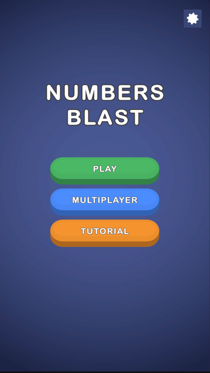
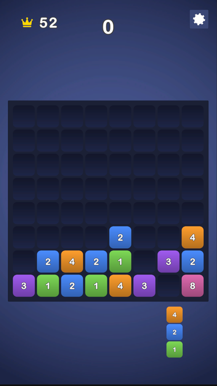
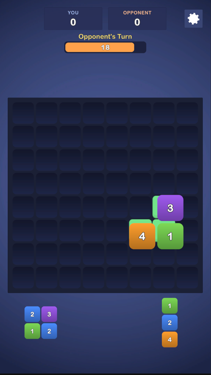

# Numbers Blast

Mavis **Senior Game Developer Case** için geliştirilmiş, Block Blast tarzı sayı-birleştirmeli
bulmaca. Bloklar 1–4 değer taşır; yerleştirilen blok, eş değerli komşularını kendine katar
(toplamları olur, zincirleme devam eder), dolan satır/sütunlar temizlenip skor verir.
Part 1 (zorunlu çekirdek oyun) tamam; opsiyonel Part 2 (inandırıcı bir AI rakibe karşı sahte
gerçek-zamanlı multiplayer) uygulanmıştır.

<p align="center">
  &nbsp;
  &nbsp;
  &nbsp;
  
</p>

**Motor:** Unity 6000.3.8f1 (6.3 LTS), UGUI + TextMeshPro, yeni Input System · **Hedef:** Android, dikey (Editor'de fare ile de oynanır).

## Nasıl çalıştırılır

1. Bu depoyu **Unity 6000.3.8f1** ile açın.
2. `Assets/Scenes/Game.unity` sahnesini açıp **Play**'e basın.
3. Testler: *Window ▸ General ▸ Test Runner* — 25 EditMode + 5 PlayMode, tümü geçiyor.

## Mimari

Tek assembly; klasörler namespace'lerle bire bir eşleşir.

```
Core          Değişmez veri + enum'lar (MoveResult, MergeStep, GameState, …)
Data          ScriptableObject'ler (board ayarları, parça şekilleri, tutorial adımları)
Gameplay      Saf mantık, UI'sız: BoardModel, TrayModel, PlacementService,
              MergeResolver, LineClearResolver, ScoreService, PieceFactory
App           Kompozisyon kökü: GameSessionController + odaklı oturum yardımcıları
              (SessionHud, GameOverSequence, InputGate) + PlayerProgress
Presentation  Board/parça/tray görselleri, animasyonlar, ortak yerleştirme önizlemesi
Input         PieceDragController (UGUI pointer olayları — fare ve dokunma tek yol)
UI            Menü, skorboard, tur/sayaç, tutorial, oyun sonu, eşleştirme ekranı
Tutorial      3 adımlı zorunlu tutorial denetleyicisi
Opponent      TurnController (tek maç döngüsü), tur sayacı, hamle değerlendirici,
              hamle koreografı, insansı sunum
Settings      SFX / müzik / titreşim + ayarlar paneli
```

**Tek pipeline.** `PlacementService.ApplyMove(board, piece, anchor)` — yerleştir, tüm
merge'leri çöz, dolu satırları temizle — tek doğruluk kaynağıdır ve dört yerden çağrılır:
canlı sürükleme önizlemesi (scratch board üzerinde), gerçek hamle, AI'ın aday değerlendirmesi
ve fail-state kontrolü. Önizleme, AI ve gerçek sonuç yapısal olarak asla ayrışamaz. Saf
`Gameplay` katmanı hiçbir UI/Input tipini referans etmez — mantık sınırı sözle değil,
namespace ile korunur.

## Kararlar

- **Önce merge, sonra clear**, sabit sırayla: parça yazılır → merge'ler çözülür (4 komşuluk,
  zincirleme) → satır/sütun temizliği değerlendirilir. Bir merge, dolu görünen satırı
  boşaltabilir — bu kuraldır ve önizleme de aynısını gösterir. Merge skor vermez; temizlik
  skoru benzersiz hücre değerlerinin toplamıdır (satır∩sütun kesişimi bir kez sayılır).
- **Parça üretimi**, parça içinde komşu iki hücreye asla eş değer vermez — parça doğarken
  kendi kendine merge olamaz. Tray 3 parçadır ve yalnızca tamamen boşalınca yenilenir.
- **Part 2, küçük tutarlılıkların toplamı olan bir illüzyondur:** paylaşılan board ve tray,
  sahte "Finding opponent…" ekranı, **iki turda da görünen 20 saniyelik geri sayım** (rakibinki
  kendi renginde), ekranda "Time's up! −5%" uyarısıyla görünür timeout cezası ve tamamen
  ekran üzerinde oynayan bir rakip: taşı ortak tray'den alır, hücrelerde gezdirir, tereddüt
  eder (bazen de hiç oyalanmadan doğrudan yerine koyar), ara sıra yanlış bırakıp geri alır — hatta bazen **yanlış taşı alıp, düşünüp, vazgeçip
  yerine koyar** ve asıl taşa uzanır — sonra yerleştirir.
- **AI iyi hamle yapmaya çalışır, kusursuz olmaya değil.** Her aday aynı hamle pipeline'ıyla
  puanlanır; en iyiler arasından ağırlıklı-rastgele seçim onu insansı kılar. Maç içi
  rubber-band, seçim genişliğini anlık skor farkına göre ayarlar (maçlar yakın kalır);
  bariz en iyi hamle (satır temizliği) asla pas geçilmez ve AI, gerçekte oynayacağından
  daha iyi görünen bir hücrenin üzerinde asla sahte gezinme yapmaz.
- **Ayarlar maçı durdurmaz** — gerçek bir online rakip gibi saat akmaya devam eder; panel
  yalnızca sizin girişinizi kilitler.
- DI framework'ü, service locator, event bus, kullanılmayan interface yok — bu ölçekte
  hepsi gereksiz tören olurdu. Projedeki her sınıf fiilen kullanılıyor.

## Bilinen durumlar / notlar

- 3 adımlı tutorial yalnızca ilk açılışta çalışır (kalıcı kayıt); menüden tekrar oynatılabilir.
- 8 renklik paletin ötesindeki merge değerleri kararlı bir golden-ratio tonu alır — yüksek
  merge'ler ayırt edilebilir ve okunur kalır.
- Rakibin turu tipik olarak ~3–4 saniye sürer; şanssız zarlarda birkaç saniye uzayabilir,
  ancak eylem listesi sonludur ve her zaman gösterdiği 20 saniyelik sayacın çok içinde biter.

## Gelecek geliştirmeler

- AI'ın rubber-band eşiğine bağlı bir zorluk seçici (eşik zaten Inspector'dan ayarlanabilir).
- Rakip turu için opsiyonel süre tavanı.
- Uçan skor yazıları için havuzlama (temizlik parlamaları zaten havuzlu).
